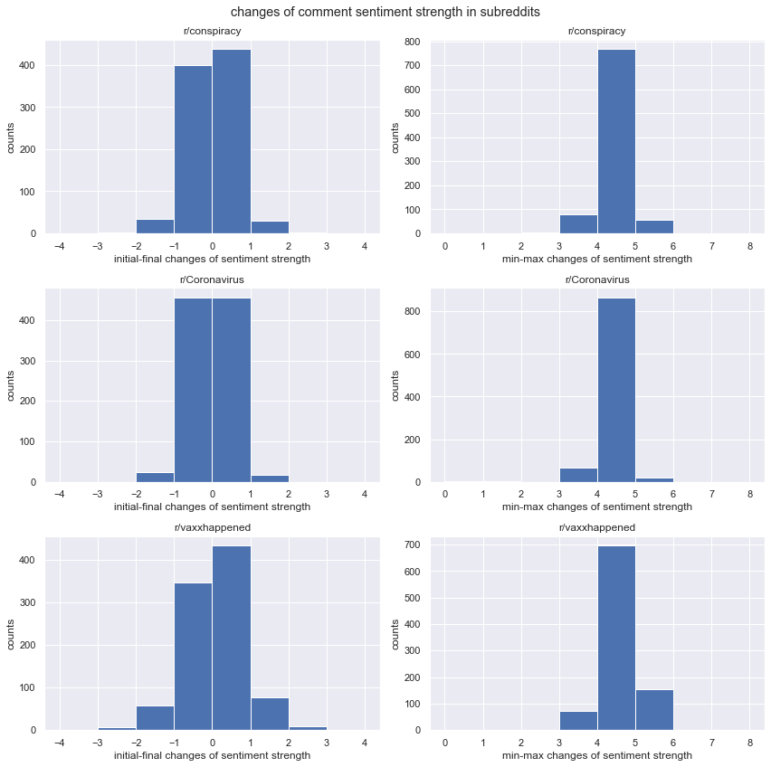
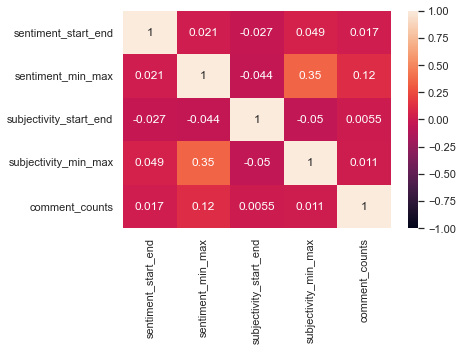

# Supplemental Code
The code and data in this repository is for reproducing research workflow and results of MACS30200 course project "Changes of sentiment strength and subjectivity in COVID-19 vaccine discourse on Reddit".\
\
The code is written in Python 3.8.12 and all of its dependencies can be installed by running the following in the terminal (with the `requirements.txt` file included in this repository):
```
pip install -r requirements.txt
```
### Data accessing and processing
You can run codes in `sample.ipynb` to access Reddit data and store in csv files, as the 3 different csv files stored in data directory.

### Opinion polarity and diversity of environments
To conduct sentiment analysis on posts from each subreddit, run `post_VADER.ipynb` to implement VADER and analyze the sentiment of posts.\
With sentiment analysis results, you can obtain the percentages of positive, neutral and negative posts in each subreddit, which allow differentiation among three subreddits and better confirm the difference of environments' opinion polarity and diversity.


r/conspiracy, as expected, shows the highest percentage of negative posts about covid-19 vaccine, and r/Coronavirus contains most neutral posts.\
However, positive posts do not have the highest percentage or count in r/vaxxhappened, which may because that one of the main topics in this subreddit is attacking anti-vaccine supporters, or anti-vaxxers, where they may not present explicit sentiment in favor of covid-19 vaccine.\
Overall, the finding of VADER results on posts helps confirm that it is reasonable to assume r/conspiracy is a like-minded anti-vaccine community, and r/Coronavirus is a diverse environment.\
Although r/vaxxhappened has relatively weak evidence of being a like-minded pro-vaccine community, general attitude in this subreddit is against anti-vaccine, and further analysis (eg. ngram) may be implemented to better identify the sentiment of posts in r/vaxxhappened.\

### Changes in sentiment strengths in each subreddit
After assessing sentiment strengths of all comments, changes were measured along two axes: temporal change and variability. Temporal change was calculated from |initial 10% comments' sentiment strengths - final 10% comments' sentiment strengths| in a discussion thread sorted by chronological order; variability was calculated from |minimum 10% comments' sentiment strengths - maximum 10% comments' sentiment strengths| in a discussion thread sorted by individual sentiment strength scores. The distributions of changes in sentiment strenths were similar across three subreddits, as shown below. 



### Correlation between discussion length and sentiment changes
The following heatmap below presents the correlation coefficients between discussion length (comment_counts) and changes in sentiment strengths and subjectivity. Variability in sentiment strengths (sentiment_min_max) and subjectivity (subjectivity_min_max) were correlated with each other, showing that subjectivity and sentiment strengths would polarize together. Only variability in sentiment strengths showed a relatively stronger correlation with discussion length, indicating that in longer discussion threads, sentiment strengths would vary more, but the change would not follow a chronological order. 



\
Cite as:\
Lee, F. Changes of sentiment strength and subjectivity in COVID-19 vaccine discourse on Reddit, (2022), GitHub repository, https://github.com/macs30200-s22/replication-materials-fiofiofiona
